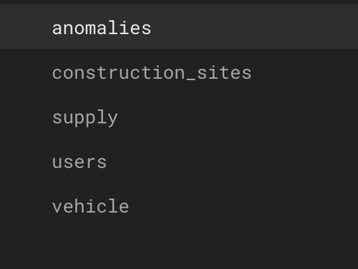

# ChantierPlus - GILLARD Mathis / HURBAIN Raphael


> [uml du projet](./READMES/project_structure_README.md)
>
> Ce modèle a évolué au fil du développement de l'application
>

## Demo 
[Demo du projet](https://www.youtube.com/watch?v=gCx70RL8c-4)


## Fonctionalitées implémentées

### 1. Rôles et Responsabilités

- **Rôle** : Les utilisateurs ont des rôles spécifiques, notamment **Responsable** et **Chef de chantier**.
- **Accès aux chantiers** : Chaque rôle a un accès limité à ses chantiers assignés. Ils peuvent :
  - Signaler des soucis sur leurs chantiers (anomalies) en ajoutant des images.
  - Voir tous leurs chantiers sur une carte interactive.

### 2. Responsabilité du Responsable

- **Création de chantiers** : Le Responsable peut créer de nouveaux chantiers en spécifiant :
  - **Localisation** via l'API **Mapbox** pour choisir une adresse précise.
  - Le **Chef de chantier** à assigner parmi les chefs déjà inscrits.
  - La **durée du chantier**.
  - L'**assignation de ressources** (véhicules, matériels, etc.).
  
- **Accès à la carte** : Le Responsable peut accéder à la liste de tous ses chantiers sur une carte interactive.

### 3. Détails d'un Chantier

- **Accès aux détails** : L'utilisateur peut accéder aux détails d'un chantier, que ce soit depuis la carte ou l'écran d'accueil de l'application.
  
### 4. Gestion des Ressources

- **Ajout de ressources** : Le Responsable peut ajouter des ressources de type **Véhicule** ou **Fourniture** pour un chantier.
  
- **Affichage des ressources** : Il est également possible d'afficher l'ensemble des ressources créées et assignées à un chantier.

### 5. Gestion des Anomalies

- **Signalement d'anomalies** : Les utilisateurs (chefs de chantier ou responsables) peuvent signaler des anomalies sur un chantier.
  - Chaque anomalie peut inclure un **titre**, une **description**, et jusqu'à **5 photos**.
  
- **Affichage des anomalies** : Il est possible d'afficher l'ensemble des anomalies signalées depuis les détails d'un chantier.

---

## Intégration de Mapbox

Ce projet utilise Mapbox pour offrir des fonctionnalités de cartographie et de recherche d'adresses dans l'application. L'objectif est de permettre une visualisation interactive des sites de construction ainsi qu'une recherche facile des localisations.

---

### **1. Affichage des sites sur une carte**

Dans la classe `MapPage`, une carte Mapbox est affichée grâce au package `flutter_map`. Les sites de construction sont représentés par des marqueurs dynamiques. Chaque marqueur affiche l'icône d'un plot de travaux et permet, lorsqu'on clique dessus, de naviguer vers un écran de détails du site.

#### **Fonctionnalités principales :**
- **Carte Mapbox interactive** : La carte est centrée sur une zone définie et utilise un style personnalisé de Mapbox.
- **Marqueurs dynamiques** : Chaque site de construction est affiché à sa position géographique sous forme de marqueur.
- **Navigation aux détails** : Cliquer sur un marqueur redirige vers l'écran des détails du site.

---

### **2. Recherche d’adresses avec autocomplétion**

La classe `AutoCompleteSearchLocation` intègre la recherche d'adresses via l'API Places de Mapbox. Elle permet aux utilisateurs de saisir une adresse et de sélectionner une suggestion pour récupérer ses coordonnées GPS.

#### **Fonctionnalités principales :**
- **Autocomplétion** : Recherche en temps réel des adresses correspondant à la saisie.
- **Sélection des résultats** : Une fois une adresse sélectionnée, son nom et ses coordonnées GPS sont renvoyés pour utilisation (par exemple, pour localiser un site ou enregistrer une adresse).

---

## Utilisation du Pattern Bloc

Le projet utilise le **pattern Bloc** pour gérer les états de l'application de manière claire et réactive. Ce pattern permet de séparer la logique métier de l'interface utilisateur, tout en simplifiant la gestion des données dynamiques.

---

### **Comment ça fonctionne ?**

1. **BlocProvider** : Permet de fournir un bloc à une partie de l'application.
2. **BlocBuilder** : Écoute les changements d'état dans le bloc et met à jour l'interface utilisateur en conséquence.
3. **Événements et États** :
    - Les **événements** déclenchent des actions (par exemple, récupérer des données).
    - Les **états** représentent le résultat de ces actions (par exemple, chargement terminé ou échec).

---

### **Exemple dans ce projet**

#### **MapPage** :
- Un bloc (`ConstructionSiteBloc`) est utilisé pour récupérer et afficher les sites de construction sur une carte.
- Les marqueurs sont mis à jour dynamiquement en fonction des données récupérées.

#### **Recherche de localisation** :
- Un autre bloc gère la recherche d'adresses avec autocomplétion via Mapbox.
- L'interface affiche les résultats de recherche et permet de sélectionner une adresse.

---

### **Utilisation du pattern bloc**

- **Réactivité** : Les données et l'interface sont toujours synchronisées.
- **Séparation des responsabilités** : La logique métier est isolée de l'interface utilisateur.
- **Extensibilité** : Il est facile d'ajouter de nouvelles fonctionnalités ou de gérer des états plus complexes.

Ce pattern offre une structure solide pour maintenir et faire évoluer le projet.

---

## Classe `ServiceResult<T>`

La classe `ServiceResult<T>` est utilisée pour gérer les résultats des opérations ou des services dans l'application. Elle permet de savoir si une opération a réussi ou échoué tout en retournant soit un contenu, soit un message d'erreur.

---


### **Comment ça fonctionne ?**
1. **Propriétés :**
   - `content` : Le résultat si tout s'est bien passé.
   - `error` : Le message d'erreur si quelque chose a échoué.

2. **Méthodes :**
   - `success` : Vérifie si l'opération a réussi (il y a un contenu et pas d'erreur).
   - `getErrorMessage()` : Retourne le message d'erreur ou un message par défaut.


## class `ServiceLocator`

Dans ce projet Flutter, nous utilisons la classe `serviceLocator` pour configurer et gérer "l'injection de dépendances". Le service locator est basé sur la bibliothèque **GetIt**, qui permet d'enregistrer et de récupérer facilement les différentes instances de services et repositories utilisés tout au long de l'application.

La fonction initializeDependencies() est responsable de l'initialisation de toutes les dépendances nécessaires, en enregistrant les services tels que AuthService, ConstructionSiteService, AnomalyService et ResourceService ainsi que leurs repositories associés dans le service locator. Cela permet de centraliser la gestion des instances et de faciliter leur utilisation dans les autres parties de l'application.

---

### **Exemple :**

#### Lorsqu'un service retourne un résultat :
```dart
Future<ServiceResult<String>> fetchData() async {
  try {
    final data = await api.getData();
    return ServiceResult(content: data); // Succès
  } catch (e) {
    return ServiceResult(error: 'Failed to fetch data'); // Échec
  }
}
```

#### Vérification du résultat :
```dart
void handleFetch() async {
  final result = await fetchData();

  if (result.success) {
    print("Succès : ${result.content}");
  } else {
    print("Erreur : ${result.getErrorMessage()}");
  }
}
```

## Architecture 

Nous avons tenté d'adopté une architecture en couches claire et modulaire pour ce projet, afin de garantir une séparation des responsabilités, faciliter la maintenabilité et rendre le code évolutif. Cette architecture repose sur trois couches principales :


1. Presentation Layer (Couche de Présentation)
La couche de présentation est responsable de l'interface utilisateur et de l'interaction avec l'utilisateur. Elle contient :

Pages : Les différentes vues ou écrans de l'application.
Blocs : Le gestionnaire d'état qui permet de centraliser et de gérer les états de l'application.
Events & States : Les événements qui déclenchent des actions et les états qui décrivent l'état de l'interface utilisateur.
Cette couche interagit avec la couche de domaine pour récupérer et envoyer des données, mais elle ne contient aucune logique métier.

2. Domain Layer (Couche Domaine)
La couche domaine est au cœur de notre application. Elle est composée des éléments suivants :

Entities : Les entités représentent les objets métiers principaux (par exemple, Chantier, Utilisateur).
Services : La logique métier est encapsulée dans des services.
Repository : Des contrat représentatnt les classe d'accès au donnée. Implémenté dans la couche data.

1. Data Layer (Couche Données)
La couche des données est responsable de l'accès aux sources de données. Elle contient :

Source Repository : Ce composant gère la communication avec les sources de données externes, telles que les API ou bases de données. En implémentant "l'interface" décrite dans la domain layer.

> Ce choix accompagné à celui d'utiliser le pattern bloc nous a beaucoup surpris quand à la quantité de code boile_plate à écrire.


## Firebase : 

Pour ce projet nous avons utilisé firebase pour : 
- l'authentification avec `Firebase Authentication`
- le stockage de donnée en générale avec `Firestore`
- Le stockage de fichier (ex : image) avec `Firtebase Storage`

Dans notre base de donnée firestore les fichiers sont séparé en 5 collectons : 



Et dans notre stockage `Firebase storage` nos fichiers respectent une certaine hiéracrhie : 

On retrouve un répertoir `anomalies`, qui contient des répertoir portant l'id d'anomaly spécifique.

Et on retrouve de la même manière un répertoir `constructionSite`, qui contient des répertoir portant l'id de constructionsite spécifique.

## Package flutter utilisé : 
- mapbox_search: pour afficher gérer l'autocompletion en recherchant des addresse
  
- Pour accéder au services firebase:
  - cloud_firestore: 
  - firebase_auth
  - firebase_core
  - firebase_storage
  
  dotted_border: ^2.1.0
  equatable: ^2.0.5


  - flutter_bloc : mettre en place le pattern bloc plus facilement
  - get_it: gérer "l'injection" de dépendance
  - image_picker: sélectionner des photo depuis le téléphone
  - flutter_dotenv: permet de stocker des variable sensible (ex clé API) dans un répertoire .env (push sur le repo pour faciliter la correction)
  - carousel_slider: afficher un carousel d'images
  - flutter_map: Pour afficher des éléments sur une carte